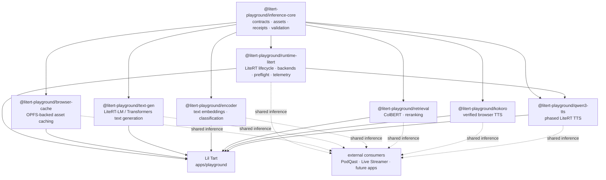

# Lil Tart

A local-first model launcher, runtime qualification lab, and reusable LiteRT.js workspace.

Lil Tart is the interactive browser app in `apps/playground`. The repository still
uses the `@litert-playground/*` package namespace underneath it, because the app and
the reusable runtime/packages are two sides of the same project.

The goal is simple: **prove a capability once, package it once, and consume it
everywhere** instead of rebuilding browser inference plumbing in every app.

Lil Tart is built around a deliberately boring workflow:

1. browse models without triggering a download
2. explicitly download and load the model you actually want
3. see which backend really resolved
4. run preflight and real inference
5. capture enough evidence to reuse that working path elsewhere

The workspace covers text, retrieval, speech, audio, vision, OCR, image
embeddings, video classification, and related local inference workloads.

## What it provides

### Lil Tart model library

The playground is a model launcher rather than a click-to-download catalog.

- selecting a model is side-effect free
- downloads happen only from an explicit model action
- downloaded assets are tracked in Lil Tart's own browser Cache Storage library
- downloaded bytes and compiled in-memory state are treated separately
- a stored model can be loaded again without redownloading
- models can be unloaded from memory without deleting their downloaded assets
- individual stored models can be removed, or the managed model library can be cleared
- model cards expose a plain-language description before the technical details
- model-family color and icons provide quick visual orientation without replacing the model name

Special multi-graph experiences such as Qwen3-TTS and the Gemma/LFM pipeline page
also require an explicit load/prepare action instead of doing heavy runtime work just
because the page was opened.

### Lil Tart guide

The Tart mascot is bound to real runtime state rather than a separate fake assistant
state machine. It reacts to model selection, download/compile progress, backend
resolution, fallback events, preflight, real inference, and runtime errors.

When enough evidence exists, the UI can show a current-session runtime receipt/path
proof separately from the adapter's durable verification level. A successful session
does **not** silently promote repository verification metadata.

The longer-term product direction is for Tart to turn a proven local runtime path into
an "add this to my app" recipe without guessing from UI state.

### Shared LiteRT runtime

`@litert-playground/runtime-litert` wraps `@litertjs/core` with the lifecycle and
runtime behavior needed by real applications:

- WebGPU, WebNN, and WASM capability probing
- automatic backend order: **WebGPU → WebNN → WASM**
- strict behavior when a backend is explicitly requested
- compiled-model caching
- concurrent load deduplication
- caller-specific cancellation for deduplicated loads
- safe invalidation of pending loads during model disposal
- named-signature inference
- model preflight with bounded synthetic inputs
- automatic cleanup of temporary preflight tensors and outputs
- shared inference coordination for serialized accelerator work
- compile, inference, fallback, and preflight telemetry
- bounded telemetry history
- tensor helpers and GPU-buffer capability probing
- safe model/runtime disposal

The existing lightweight `RuntimeContext` contract remains usable by model
packages that only need `loadModel`, `loadNpy`, and `fetchBuffer`. The managed
runtime is additive rather than a replacement for those package contracts.

### Playground dogfooding

The React playground uses `@litert-playground/runtime-litert` itself. It does not
maintain a separate private LiteRT loader.

That means runtime behavior exercised in Lil Tart is the same behavior intended for
downstream consumers. The UI exposes:

- requested vs. resolved accelerator
- compile timing
- fallback count
- model preflight
- preflight timing and output count
- recent runtime/inference events
- current-session runtime path proof
- durable adapter verification evidence separately from current-session runtime state

Changing the requested accelerator unloads the current model. Lil Tart does not
silently recompile or download a different path behind the user's back; loading is an
explicit action.

## Architecture



The dependency direction is intentionally generic → specific. Product concepts
such as episodes, stream state, OBS control, game logic, or UI semantics belong
in consuming applications rather than in the shared runtime packages.

## Workspace layout

| Path | Package | Purpose |
|------|---------|---------|
| `apps/playground` | `playground` | **Lil Tart** — React + Vite + Tailwind model launcher and qualification UI |
| `packages/inference-core` | `@litert-playground/inference-core` | Model manifests, asset resolvers, receipts, capability selection, validation, errors, shared contracts |
| `packages/runtime-litert` | `@litert-playground/runtime-litert` | Managed LiteRT.js runtime, backend selection, compiled-model lifecycle, preflight, coordination, telemetry |
| `packages/browser-cache` | `@litert-playground/browser-cache` | Browser-side model/tensor cache primitives for reusable consumers |
| `packages/kokoro` | `@litert-playground/kokoro` | Kokoro TTS through `kokoro-js` using q8/WASM |
| `packages/qwen3-tts` | `@litert-playground/qwen3-tts` | Phased Qwen3-TTS pipeline over talker, MTP, and codec LiteRT graphs |
| `packages/text-gen` | `@litert-playground/text-gen` | `LiteRtLmTextPipeline` over `@litert-lm/core` plus LFM2.5, Gemma 4, and Qwen3 manifests |
| `packages/retrieval` | `@litert-playground/retrieval` | `ColBertPipeline`, multi-vector embeddings, and late-interaction scoring |
| `packages/encoder` | `@litert-playground/encoder` | Text embeddings and token-classification pipelines |
| `packages/image-embedding` | `@litert-playground/image-embedding` | Reusable image-embedding package |
| `packages/video-classification` | `@litert-playground/video-classification` | Browser video-classification support and runtime checks |
| `examples/minimal-kokoro` | `@litert-playground/example-kokoro` | Minimal standalone Kokoro browser example |
| `examples/minimal-qwen3-tts` | `@litert-playground/example-qwen3-tts` | Minimal Qwen3-TTS example and compatibility harness |

Workspace globs cover `apps/*`, `packages/*`, and `examples/*`.

## Quick start

Requirements:

- Node.js 22+
- pnpm 11+

```bash
pnpm install
pnpm dev
```

The development command starts Lil Tart from `apps/playground`.

Before merging runtime or package changes, run:

```bash
pnpm verify
```

`pnpm verify` is also the authoritative deterministic CI gate. Real browser
qualification is a separate evidence-producing step; see [Verification philosophy](#verification-philosophy).

## Commands

| Command | Runs |
|---------|------|
| `pnpm install` | Install workspace dependencies |
| `pnpm dev` | Start the playground dev server |
| `pnpm build` | Build all workspace projects |
| `pnpm preview` | Preview the playground production build |
| `pnpm test` | Run tests in all workspace projects |
| `pnpm test:boundaries` | Verify package dependency and architecture boundaries |
| `pnpm test:compatibility` | Pack and consume the supported external package surface |
| `pnpm test:qualification` | Run deterministic runtime-qualification contract tests |
| `pnpm qualify` | Run real browser qualification cases and write evidence results |
| `pnpm test:watch` | Watch-mode tests for the playground |
| `pnpm typecheck` | Type-check all workspace projects |
| `pnpm verify` | Typecheck + tests + boundary + compatibility + qualification-contract tests + production builds |

GitHub Actions runs the deterministic `pnpm verify` gate for pull requests. The
`Runtime qualification` workflow runs `pnpm qualify` on demand and uploads its
evidence artifacts.

## Runtime example

Inside the workspace, a managed LiteRT runtime can be created from the shared
asset resolver and runtime packages:

```ts
import { createHttpAssetResolver } from '@litert-playground/inference-core'
import { createLiteRtRuntime } from '@litert-playground/runtime-litert'

const context = await createLiteRtRuntime({
  backend: 'auto',
  assets: createHttpAssetResolver('https://example.com/models/'),
})

const model = await context.liteRt.loadModel('model.tflite')

console.log(context.backend)
console.log(context.liteRt.getModelInfo('model.tflite'))
```

Model qualification can use the same runtime:

```ts
const result = await context.liteRt.preflight('model.tflite')

console.log({
  backend: result.resolvedBackend,
  compileMs: result.compileDurationMs,
  inferenceMs: result.inferenceDurationMs,
  outputs: result.outputCount,
})
```

Preflight-generated input tensors and discarded output tensors are owned and
cleaned up by the runtime. Inputs supplied through a custom `createInputs`
callback remain caller-owned.

## TTS capability status

| Capability | Backend | Status |
|------------|---------|--------|
| **Kokoro** | Browser WASM (`kokoro-js`, q8) | **Verified** audible browser synthesis at 24 kHz mono |
| **Qwen3-TTS** | Native/local LiteRT runtime | **Classified native/local** rather than practical browser-WASM |

### Kokoro

Kokoro is the current verified browser TTS path. The package has produced real
audible browser output, not merely a successful build or mocked inference call.

`@litert-playground/kokoro` also serves as the first real external shared-package
consumer path from this repository.

### Qwen3-TTS

Qwen3-TTS is represented as three host-orchestrated LiteRT graphs:

1. talker
2. MTP
3. codec

The current model set exceeds the practical browser WASM/JavaScript memory
budget during prefill, even after experiments with MTP quantization, prompt and
codec residency, reduced KV capacity, and browser-memory variants.

The `browserMemory` manifest variant (`mtp_folded_int8`) and short-KV talker
exports remain useful compatibility probes for future LiteRT.js/runtime
improvements. The package architecture remains valuable for native/local LiteRT
consumers even where browser-WASM is not practical.

## Verification philosophy

A build passing does **not** mean a model works.

The repository separates:

- package/type correctness
- runtime compilation
- real inference
- output validation
- manual audible/visual verification where appropriate

Lil Tart makes the same distinction in adapter metadata. Every adapter has
an evidence level; adapters without an explicit `verification` record are shown
as **Registered** rather than implicitly treated as working.

The levels are monotonic claims about captured evidence:

| Evidence level | Meaning |
|----------------|---------|
| `registered` | Adapter/model wiring exists; no runtime claim is implied |
| `compile-verified` | The model compiled on the recorded backend |
| `inference-verified` | Real inference completed on the recorded backend |
| `output-verified` | Inference completed and output passed model-specific validation |
| `manually-verified` | Human-observable output was checked where semantic quality cannot be established mechanically (for example audible TTS or visual output) |

An adapter verification record may also name the backend(s), verification date,
and a repository path or URL containing the evidence. Current-session UI state
such as “Ready”, compile timing, or a successful preflight never upgrades this
durable evidence level by itself.

`pnpm verify` validates code, contracts, tests, package boundaries, and builds. It
does **not** by itself prove every registered adapter has successfully run its
real model. Use `pnpm qualify` (or the manually dispatched `Runtime qualification`
workflow) for browser-observed qualification cases, and only promote an adapter's
verification level when the corresponding evidence exists.

Real-model and audio findings are kept under `docs/verification/`. No capability
should be promoted to “working” from build output alone.

## Package boundaries

The repository includes boundary tests to keep the shared layer genuinely
shared. In particular:

- examples should consume public package entrypoints
- `inference-core` must remain independent of model-specific packages
- the playground must consume `runtime-litert` instead of recreating LiteRT
  loading directly
- runtime policy must remain product-independent

A useful extraction rule is:

> If the code still makes sense when none of the consuming products exist, it is
> probably a package candidate.

## External consumption

Consuming applications should pin every shared inference package to one **Lil
Tart** Git SHA. The canonical repository is `myrqyry/lil-tart`; the package
namespace intentionally remains `@litert-playground/*` so the repository rename
does not create a gratuitous package-API migration.

See [Package revision policy](docs/package-revision-policy.md) for the exact
pinning rules and the supported compatibility surface.

The downstream local-inference stack is now exercised as an actual packed
external consumer, not merely as workspace imports. The compatibility gate
covers:

- runtime contracts + LiteRT lifecycle: `inference-core`, `runtime-litert`
- browser asset persistence: `browser-cache`
- local language generation: `text-gen`
- embeddings and RAG primitives: `encoder`, `retrieval`
- speech generation: `kokoro`, `qwen3-tts`
- reusable image/video inference packages

Packages remain `private: true` because they are not registry releases. They are
still intentionally consumable through SHA-pinned Git `path:` dependencies;
`pnpm test:compatibility` packs, installs, type-checks, and builds that external
surface. Product-specific worker orchestration, playback, UI state, and
persistence stay in the consuming application.

## Project direction

Lil Tart is intended to be the qualification and shared-infrastructure home for
reusable local inference capabilities:

```text
prove model/runtime behavior
        ↓
add verification + receipts
        ↓
generalize the reusable layer
        ↓
publish/expose a package boundary
        ↓
consume it from applications
        ↓
feed generic improvements back into playground
```

The result should be fewer copied runtimes, fewer product-specific inference
forks, and a much clearer answer to the important question: **does this model
actually work in this environment, on this backend, with evidence?**

## License

Shared packages are currently licensed under Apache-2.0 as declared by their
package manifests.
